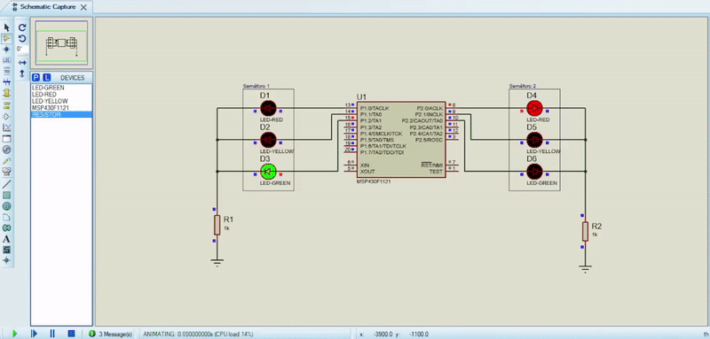

# Sistema para controle de dois semáforos

Este projeto consiste em um sistema para controlar dois semáforos em um cruzamento de duas vias simples. Esse sistema foi implementado para o hardware MSP430F1121. Além do código em C, o projeto também contém a simulação no programa Proteus 8

Cada semáforo foi configurado para ficar 10 segundos com a luz verde acesa, 5 segundos com a luz amarela acesa e 15 segundos com a luz vermelha acesa. Essa configuração pode ser mudada por meio dos argumentos das funções __delay_cycles. Cada unidade dentro dessa função equivale a 1µs, ou seja, 1000000 unidades equivalem a 1 segundo.

Simulação do sistema:

<h1>
    
</h1>